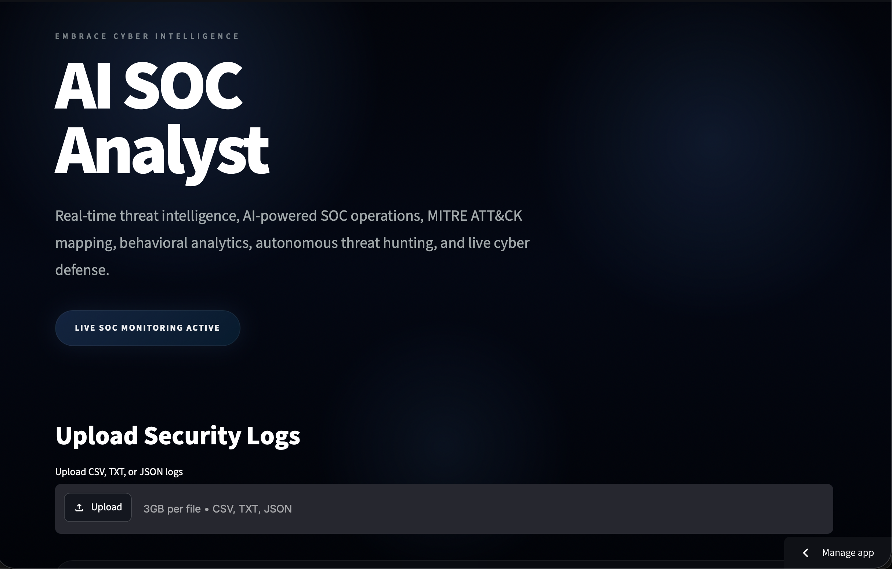
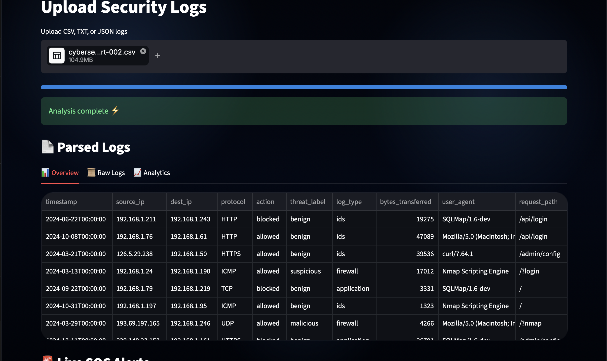
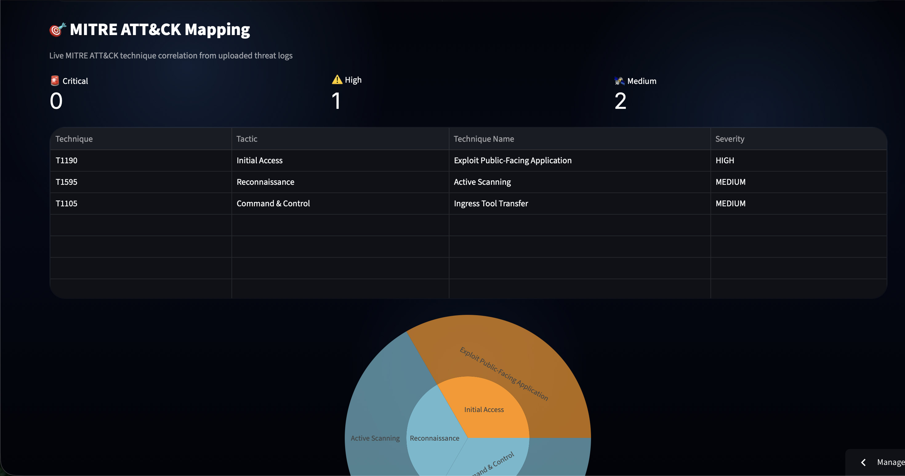

# AI SOC Analyst

AI-powered Security Operations Center for real-time threat intelligence, MITRE ATT&CK mapping, behavioral analytics, and cyber defense.

---

## Live Demo

[Open Streamlit App]([YOUR_STREAMLIT_LINK](https://ai-soc-analyst-jz6lcgwcgkmbqylsk9mtni.streamlit.app/))

---

## Dashboard Preview



---

## Threat Analysis



---

## MITRE Mapping



---

## Features

- Real-time threat intelligence dashboard
- MITRE ATT&CK framework mapping
- IOC extraction and enrichment
- AI-powered threat analysis
- Behavioral analytics
- Live SOC monitoring
- Threat severity scoring
- VirusTotal integration
- Attack graph visualization
- Interactive cyber defense UI

---

## Tech Stack

- Python
- Streamlit
- OpenAI API
- VirusTotal API
- HTML/CSS
- JavaScript

---

## Run Locally

```bash
pip install -r requirements.txt
streamlit run app.py
```
# AI SOC Analyst

AI-powered Security Operations Center (SOC) platform for real-time cyber threat analysis, IOC extraction, MITRE ATT&CK mapping, and autonomous security monitoring.

## Live Demo

[Streamlit Deployment]([YOUR_STREAMLIT_LINK_HERE](https://ai-soc-analyst-jz6lcgwcgkmbqylsk9mtni.streamlit.app/))

---

## Features

- Real-time threat intelligence dashboard
- MITRE ATT&CK framework mapping
- IOC extraction and enrichment
- AI-powered threat analysis
- Behavioral analytics
- Live SOC monitoring
- Threat severity scoring
- VirusTotal integration
- Attack graph visualization
- Interactive cyber defense UI

---

## Tech Stack

### Frontend
- Streamlit
- HTML/CSS
- JavaScript

### Backend
- Python
- OpenAI API
- VirusTotal API

### Security & Intelligence
- MITRE ATT&CK
- IOC Extraction
- Threat Correlation
- Behavioral Analysis

---

## Project Structure

```bash
app.py
analyzer.py
attack_graph.py
detections.py
geoip.py
ioc_extractor.py
live_monitor.py
mitre_mapper.py
severity.py
timeline.py
virustotal_checker.py
```

---

## Installation

```bash
git clone https://github.com/angelgarg7/ai-soc-analyst.git
cd ai-soc-analyst
pip install -r requirements.txt
streamlit run app.py
```

---

## Environment Variables

Create a `.env` file:

```env
OPENAI_API_KEY=your_key
VT_API_KEY=your_key
```

---

## Screenshots


---

## Future Improvements

- Multi-user authentication
- SIEM ingestion
- SOC analyst workspaces
- PDF threat reports
- Real-time alert streaming
- Threat intelligence feeds
- Analyst case management

---

## Author

Angel Garg

GitHub:
https://github.com/angelgarg7
